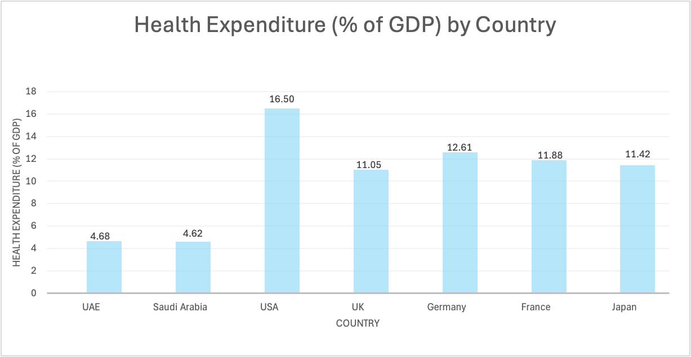
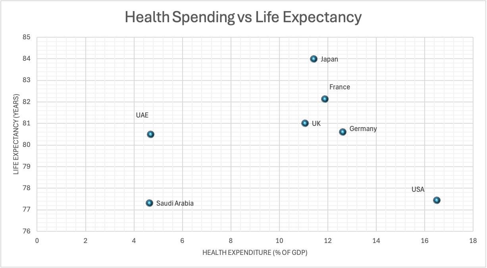

# Health Expenditure and Life Expectancy Across Countries

## Introduction

Life expectancy at birth is a widely used indicator of population health and health system performance. Although higher health expenditure is generally expected to improve health outcomes, international comparisons reveal substantial differences in life expectancy across countries with similar levels of spending.

This exploratory analysis examines the relationship between health expenditure and life expectancy across selected countries.

---

## Data Source

World Bank – World Development Indicators

Indicators used:

- Current health expenditure (% of GDP)
- Hospital beds (per 1,000 people)
- Physicians (per 1,000 people)
- Life expectancy at birth (years)

Countries included:

UAE, USA, UK, Germany, France, Japan, Saudi Arabia

Period:

2015–2022 (analysis based on latest comparable year).

---

## Methods

Countries were compared using descriptive analysis and visualizations.

A scatter plot was used to examine the relationship between:

Health expenditure (% of GDP)  
and  
Life expectancy at birth.

---

## Results

The analysis shows a positive but modest relationship between health expenditure and life expectancy.

While higher spending is generally associated with better health outcomes, notable differences exist between countries.

Some countries achieve relatively high life expectancy with moderate spending, while others spend significantly more without proportional improvements in outcomes.

---

## Figures

### Health Expenditure by Country

### Health Spending vs Life Expectancy

---

## Key Insights

1. Healthcare expenditure varies significantly across countries.

2. Higher spending tends to correlate with higher life expectancy.

3. Differences suggest that health outcomes depend not only on spending levels but also on the efficiency and organization of health systems.

---

## Relevance

From a health economics perspective, these findings highlight the importance of evaluating **value for money** in healthcare spending rather than focusing solely on expenditure levels.